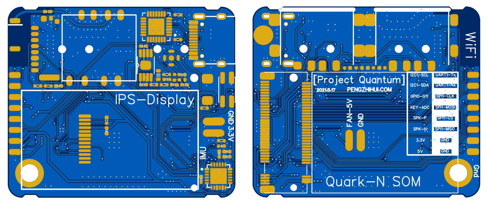

# QuarkN-Transfer

 

手动把稚晖君的 [Project Quantum](https://github.com/peng-zhihui/Project-Quantum) 项目的 Quark N 底板导入了立创EDA。

手动工作如下：

- 给原理图匹配了焊盘
- 重新匹配原理图与PCB
- 消除飞线报错
- 稍微修改了设计规则和铺铜规则
- 因为铺铜效果不同，增加了一些 GND 过孔
- 调整了丝印字体和位置

注意事项：

- 暂未经过实际打样测试
- 可以通过DRC检查，但设计规则不太完善，有时有重叠报错，但实际有间隙
- 每次从原理图同步PCB后，会有部分导线网络号抽风 (AD导入文件的实心填充块的网络号不会被原理图改变)，但是抽风的数量很少可以手动消除

